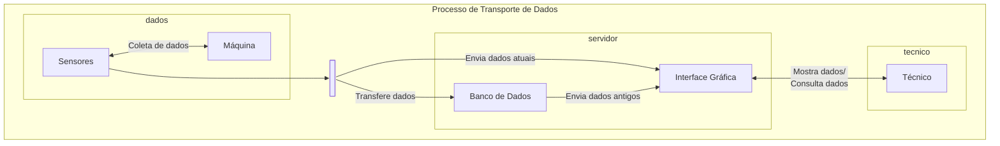
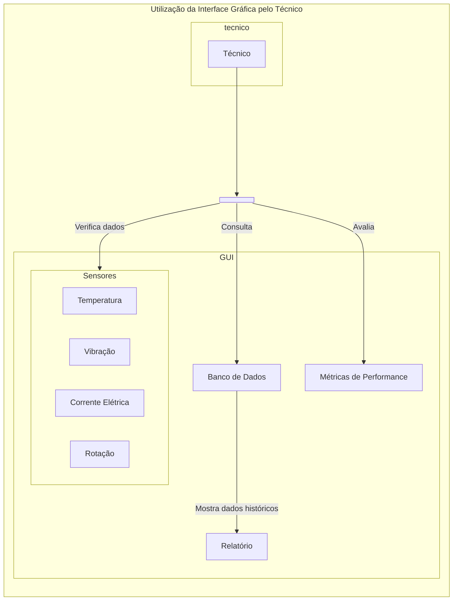
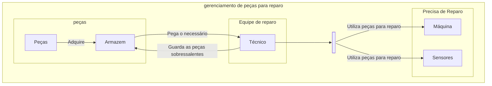

Diagrama de trânsito de dados entre sensor e servidor:

```mermaid
flowchart TD
subgraph Processo de Transporte de Dados
        subgraph dados
            M[Máquina]
            Info[Sensores]
        end
    
        subgraph servidor
            DB[Banco de Dados]
            GUI[Interface Gráfica]
        end

        A@{ shape: "fork", label: "Fork or Join" }
    
        subgraph tecnico
        T[Técnico]
        end
    
end

    Info <-- Coleta de dados --> M
    Info ---> A
    A -- Transfere dados --> DB
    A -- Envia dados atuais --> GUI
    GUI <-- Mostra dados/<br>Consulta dados --> T
    DB -- Envia dados antigos --> GUI
```

Diagrama de utilização da interface gráfica pelo técnico:

```mermaid
flowchart LR
    subgraph Utilização da Interface Gráfica pelo Técnico

        subgraph tecnico
        T[Técnico]
        end

        A@{ shape: "fork", label: "Fork or Join" }

        subgraph GUI
        DB[Banco de Dados]
        Rel[Relatório]
        Met[Métricas de Performance]

            subgraph Sensores
                Temp[Temperatura]
                Vib[Vibração]
                CE[Corrente Elétrica]
                Rot[Rotação]
            end

        end
        
    end

    T ----> A
    A -- Verifica dados --> Sensores
    A -- Consulta --> DB
    DB -- Mostra dados históricos --> Rel
    A -- Avalia --> Met


```

Diagrama de gerenciamento de peças para reparo:

```mermaid
flowchart TD
subgraph gerenciamento de peças para reparo
   
        subgraph Precisa de Reparo
            M[Máquina]
            S[Sensores]
        end


        subgraph Equipe de reparo
        T[Técnico]
        end
   
        subgraph peças
            A[Armazem]
            P[Peças]
        end


        F@{ shape: "fork", label: "Fork or Join" }
   
   
end


    P -- Adquire --> A
    A -- Pega o necessário --> T
    T ---> F
    F -- Utiliza peças para reparo --> M
    F -- Utiliza peças para reparo --> S
    T -- Guarda as peças sobressalentes --> A
```
