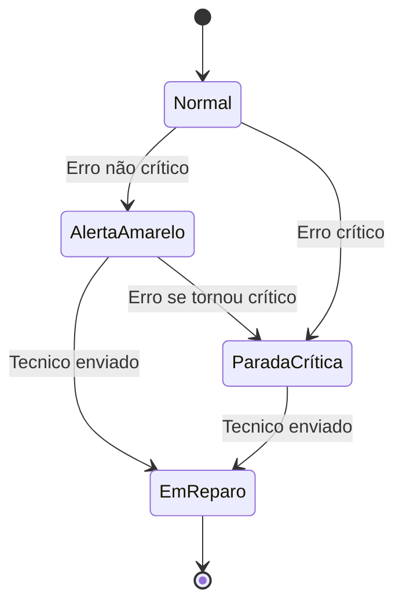
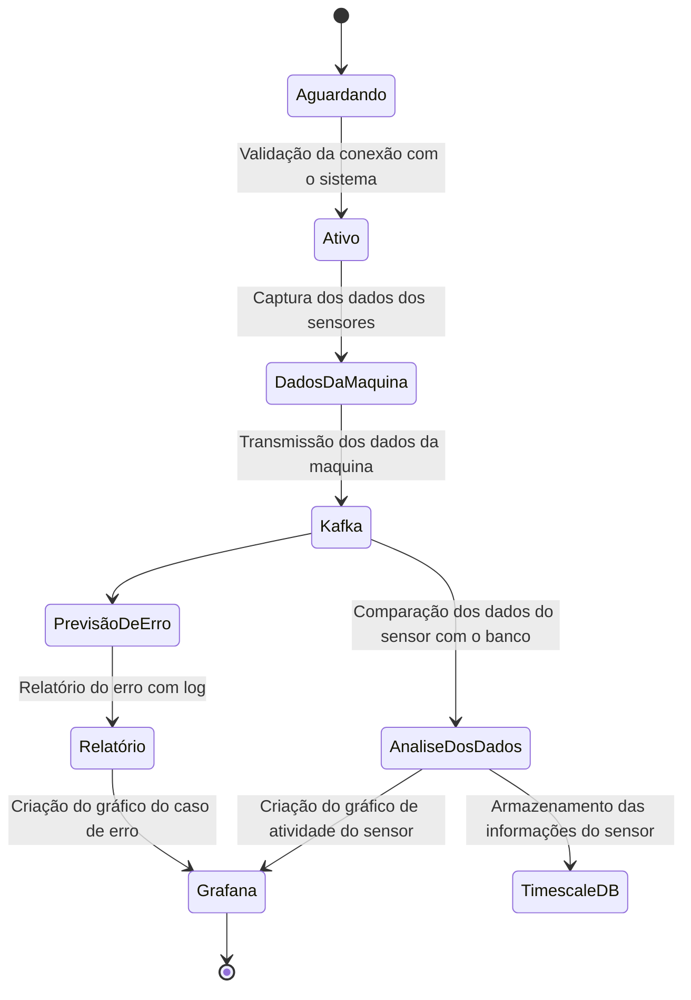
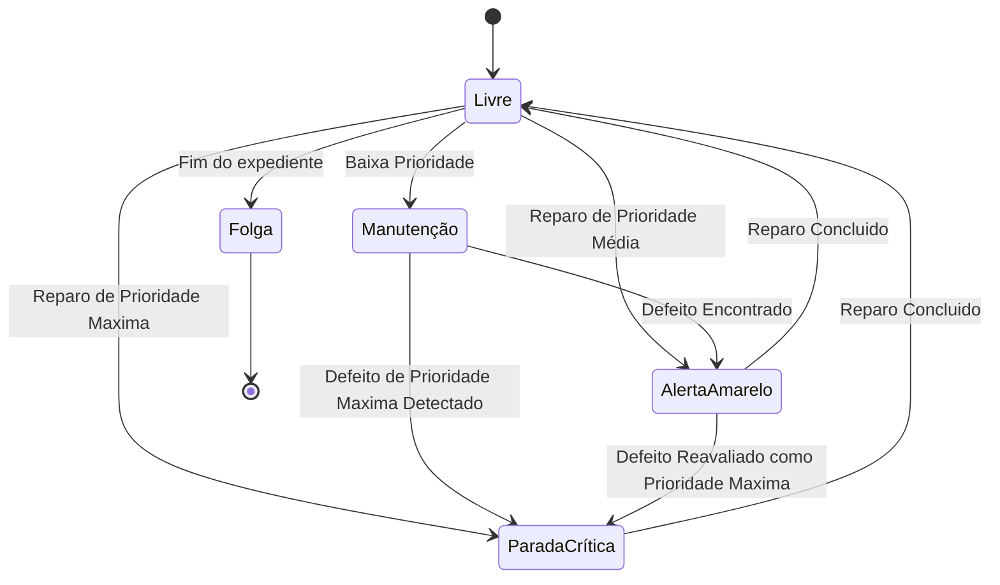

Diagrama do estado atual da máquina:

```mermaid
stateDiagram-v2
    [*] --> Normal
    Normal --> AlertaAmarelo : Erro não crítico
    AlertaAmarelo --> EmReparo : Tecnico enviado
    Normal --> ParadaCrítica : Erro crítico
    AlertaAmarelo --> ParadaCrítica : Erro se tornou crítico
    ParadaCrítica --> EmReparo : Tecnico enviado
    EmReparo --> [*]
```

Diagrama do estado atual do sensor:

```mermaid
stateDiagram-v2
    [*] --> Aguardando 
    Aguardando --> Ativo : Validação da conexão com o sistema
    Ativo --> DadosDaMaquina : Captura dos dados dos sensores
    DadosDaMaquina --> Kafka : Transmissão dos dados da maquina


    Kafka --> AnaliseDosDados : Comparação dos dados do sensor com o banco
    Kafka --> PrevisãoDeErro : 


    PrevisãoDeErro --> Relatório : Relatório do erro com log
    Relatório --> Grafana : Criação do gráfico do caso de erro


    AnaliseDosDados --> TimescaleDB : Armazenamento das informações do sensor
    AnaliseDosDados --> Grafana : Criação do gráfico de atividade do sensor
    Grafana --> [*]
```

Diagrama do estado atual do técnico:

```mermaid
stateDiagram-v2
    [*] --> Livre
    Livre --> Manutenção : Baixa Prioridade
    Livre --> AlertaAmarelo : Reparo de Prioridade Média
    Livre --> ParadaCrítica : Reparo de Prioridade Maxima
    Livre --> Folga : Fim do expediente
    Manutenção --> AlertaAmarelo : Defeito Encontrado
    Manutenção --> ParadaCrítica : Defeito de Prioridade Maxima Detectado
    AlertaAmarelo --> ParadaCrítica : Defeito Reavaliado como Prioridade Maxima
    AlertaAmarelo --> Livre : Reparo Concluido
    ParadaCrítica --> Livre : Reparo Concluido
    Folga --> [*]
```
