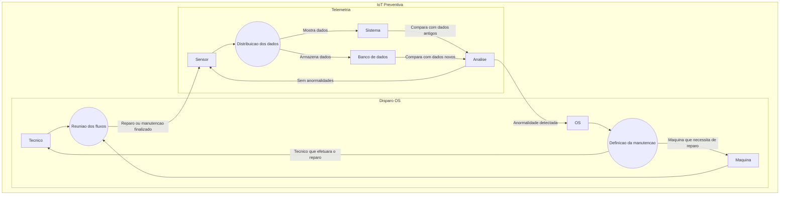

```mermaid

flowchart TD

%% Processo geral de manutenção preventiva.
subgraph IoT_Preventiva["IoT Preventiva"]

    %% Etapa de coleta e análise dos dados.
    subgraph Telemetria["Telemetria"]
        S[Sensor]
        A[Analise]
        Sis[Sistema]
        B[Banco de dados]

        %% Ponto de divisão do fluxo de dados.
        F((Distribuicao dos dados))
    end

    %% Etapa de abertura e execução da Ordem de Serviço.
    subgraph Disparo_OS["Disparo OS"]
        T[Tecnico]
        O[OS]
        M[Maquina]

        %% Ponto de divisão para identificar técnico e máquina.
        F2((Definicao da manutencao))

        %% Ponto de junção após a definição dos responsáveis.
        F3((Reuniao dos fluxos))
    end

end

%% O sensor envia os dados coletados.
S --> F

%% Os dados são armazenados no banco.
F -->|Armazena dados| B

%% Os dados também são apresentados no sistema.
F -->|Mostra dados| Sis

%% O sistema encaminha os dados para análise.
Sis -->|Compara com dados antigos| A

%% O banco fornece os dados anteriores para comparação.
B -->|Compara com dados novos| A

%% Sem anormalidades, o monitoramento continua.
A -->|Sem anormalidades| S

%% Uma anormalidade gera uma Ordem de Serviço.
A -->|Anormalidade detectada| O

%% A OS inicia a definição da manutenção.
O --> F2

%% Identificação do técnico responsável.
F2 -->|Tecnico que efetuara o reparo| T

%% Identificação da máquina que precisa de manutenção.
F2 -->|Maquina que necessita de reparo| M

%% O técnico segue para a etapa de junção.
T --> F3

%% A máquina também segue para a etapa de junção.
M --> F3

%% Após a manutenção, o monitoramento é retomado.
F3 -->|Reparo ou manutencao finalizado| S

```
