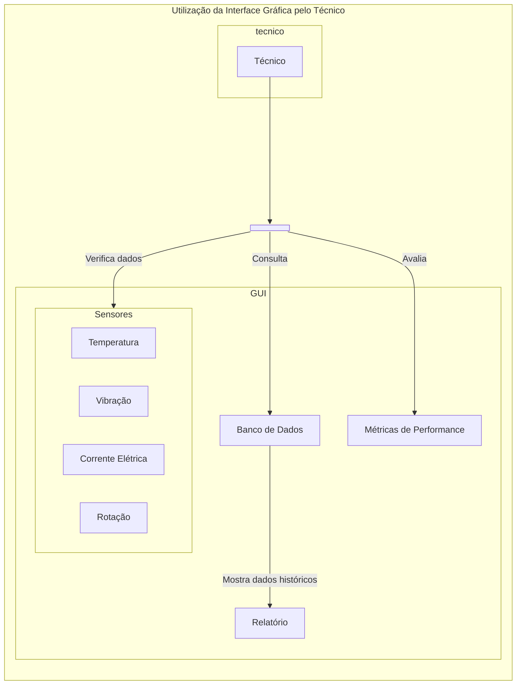

```mermaid
flowchart LR
    subgraph Utilização da Interface Gráfica pelo Técnico

        subgraph tecnico
        T[Técnico]
        end

        A@{ shape: "fork", label: "Fork or Join" }

        subgraph GUI
        DB[Banco de Dados]
        Rel[Relatório]
        Met[Métricas de Performance]

            subgraph Sensores
                Temp[Temperatura]
                Vib[Vibração]
                CE[Corrente Elétrica]
                Rot[Rotação]
            end

        end
        
    end

    T ----> A
    A -- Verifica dados --> Sensores
    A -- Consulta --> DB
    DB -- Mostra dados históricos --> Rel
    A -- Avalia --> Met


```
